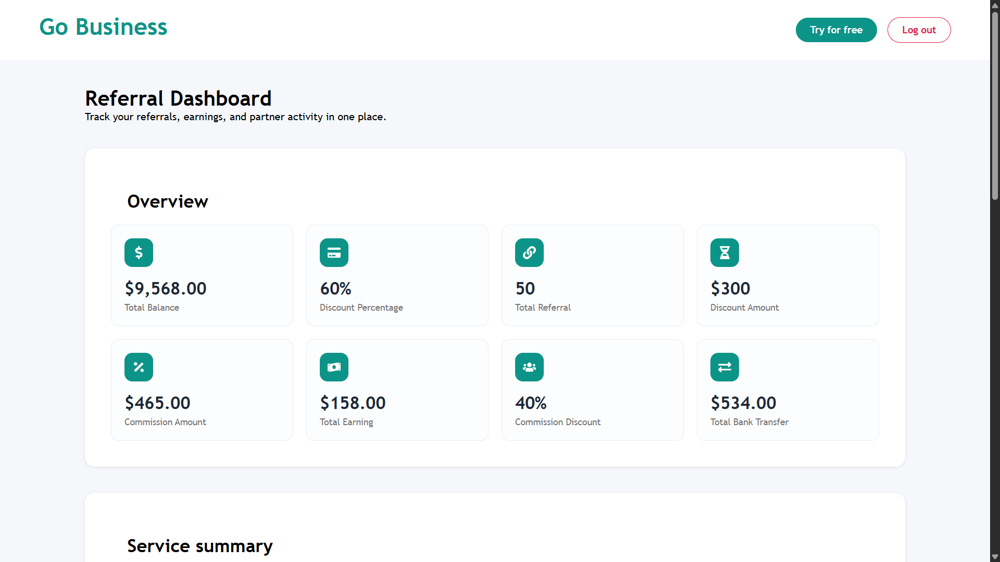
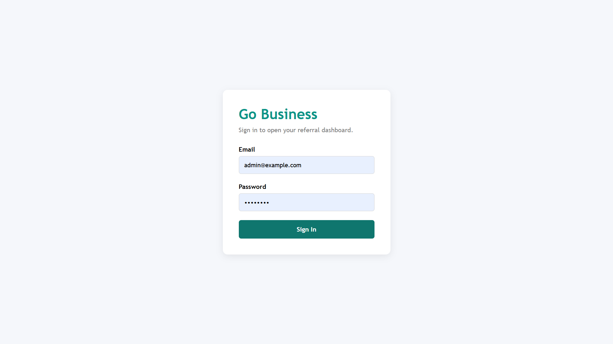
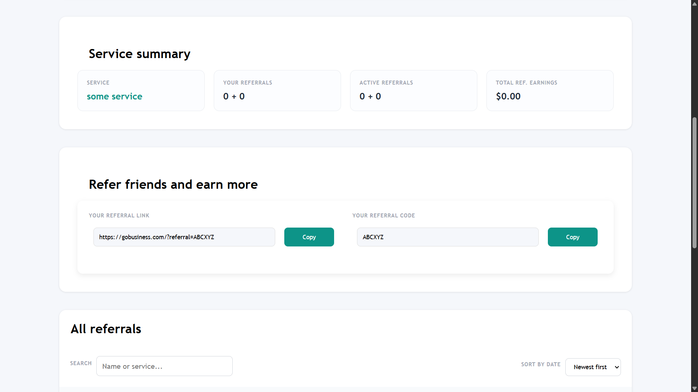
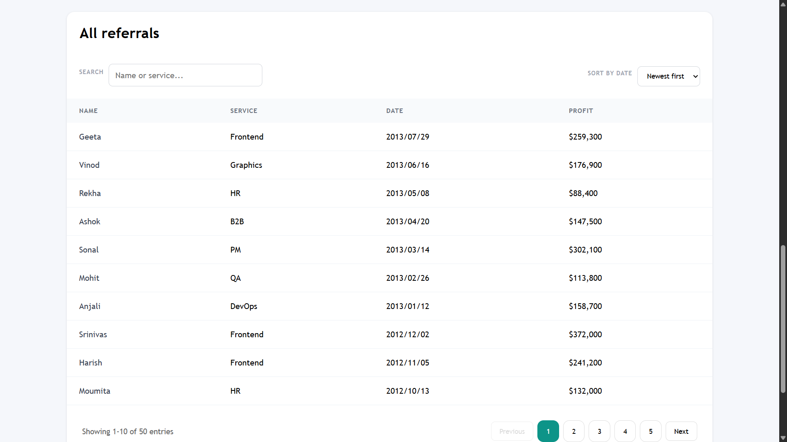
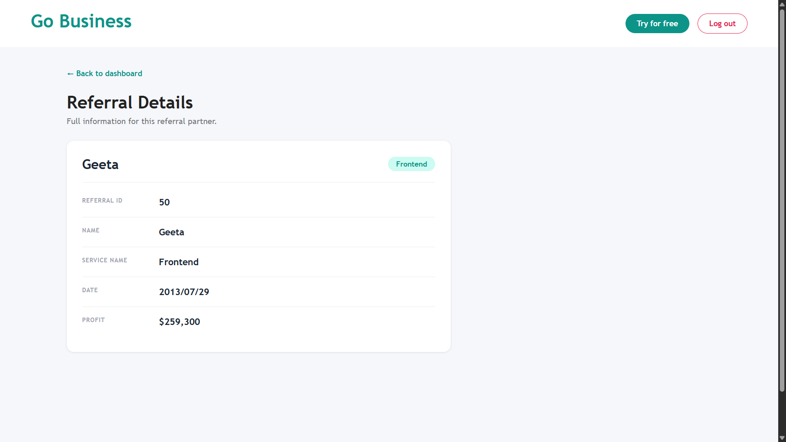
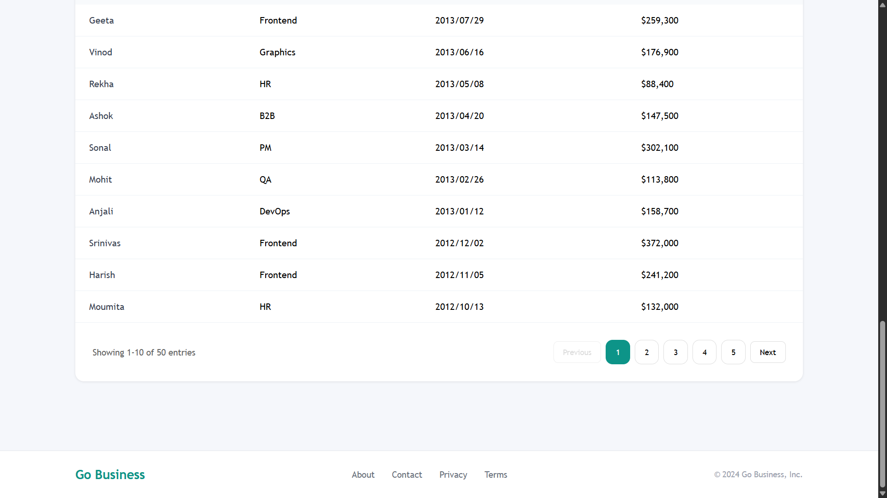

# 🚀 Referral Dashboard

<div align="center">

### Modern • Responsive • React + Vite

A responsive **Referral Management Dashboard** built using **React, Vite, React Router, Axios, and JavaScript**. The application provides an intuitive interface for managing referrals, viewing summaries, searching, sorting, and navigating referral data efficiently.




</div>

---

# 📖 Overview

The Referral Dashboard is a React-based web application that enables users to manage referral information through a clean, responsive, and user-friendly interface.

It includes authentication, referral tracking, search functionality, sorting, pagination, and dashboard analytics while following modern React development practices.

---

# ✨ Features

- 🔐 User Login Authentication
- 📊 Dashboard Overview
- 📈 Referral Summary Cards
- 👥 Referral Management
- 🔍 Search Referrals
- ↕️ Sort Referral Data
- 📄 Pagination
- 📱 Fully Responsive Design
- ⚡ Fast Performance with Vite
- 🎨 Modern UI

---

# 🖼️ Screenshots

## 🔐 Login



---

## 📊 Dashboard


---

## 📈 Summary



---

## 👥 Referrals



---

## 📋 Referral Details



---

## 📄 Pagination



---

# 🛠️ Tech Stack

| Technology | Purpose |
|------------|---------|
| React 19 | Frontend |
| Vite | Build Tool |
| JavaScript (ES6+) | Programming Language |
| React Router DOM | Routing |
| Axios | API Requests |
| CSS3 | Styling |
| js-cookie | Authentication |

---

# 📂 Project Structure

```text
referral-dashboard
│
├── public/
├── screenshots/
├── src/
│   ├── components/
│   ├── pages/
│   ├── App.jsx
│   └── main.jsx
├── package.json
├── vite.config.js
└── README.md
```

---

# ⚙️ Installation

### Clone the repository

```bash
git clone https://github.com/your-username/referral-dashboard.git
```

### Navigate to the project

```bash
cd referral-dashboard
```

### Install dependencies

```bash
npm install
```

### Start development server

```bash
npm run dev
```

---

# 🚀 Build for Production

```bash
npm run build
```

Preview the production build:

```bash
npm run preview
```

---

# 📱 Responsive Design

Optimized for:

- 💻 Desktop
- 📱 Mobile
- 📲 Tablet

---

# 🎯 Future Enhancements

- 📊 Advanced Analytics
- 🌙 Dark Mode
- 📤 Export Referrals (CSV/PDF)
- 🔔 Notifications
- 👤 User Profile
- 📈 Interactive Charts
- 🔒 Role-Based Access Control
- ☁️ Backend Integration

---

# 👨‍💻 Author

**Anjan M**

Final Year Computer Science Engineering Student

Passionate about React, Web Development, and Software Engineering.

---

# ⭐ Support

If you like this project, don't forget to **⭐ Star** the repository and share your feedback!

---

<div align="center">

### Built with ❤️ using React + Vite

</div>
